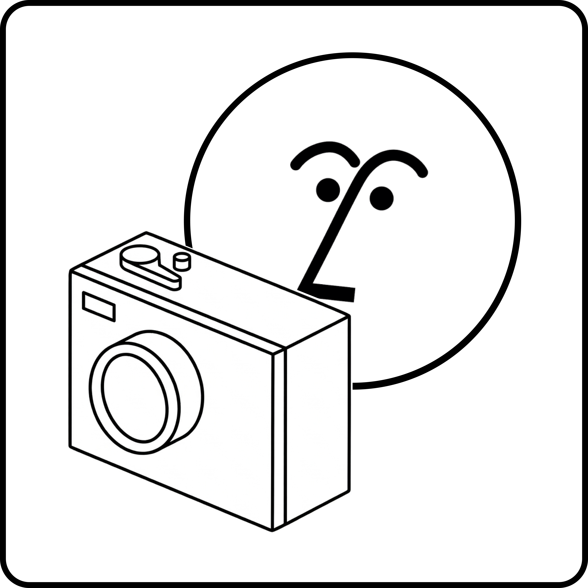

<div align="center">
  
  
  # PageShutter
  
  A Screenshot Capture Tool for Notion Agents
</div>

---

A custom [Notion Worker](https://www.notion.so/) that gives your Notion AI Custom Agent the ability to **take screenshots of any website** and return a shareable image link — all from a simple chat command.

## ⚠️ Beta Notice

**Notion Custom Agents** and the **Notion Worker SDK** are currently in beta and subject to change. This tool is not recommended for production environments. Always test thoroughly before relying on this in critical workflows.


## What Does This Do?

Imagine asking your Notion AI Custom Agent:

> "Take a screenshot of https://example.com"

Behind the scenes, this tool:

1. Receives the website URL from the agent.
2. Sends the URL to [BrowserStack](https://www.browserstack.com/) (a cloud browser service) to render the page in a real Chrome browser.
3. Waits for the screenshot to finish processing.
4. Returns a public link to the screenshot image, right back into your Notion conversation.

No browser extensions, no manual screenshots — just ask and receive.

## How It Works (The Simple Version)

```
You (in Notion) ──► Notion AI Custom Agent ──► This Tool ──► BrowserStack ──► Screenshot URL
```

1. **You** type a message in Notion asking the agent to capture a screenshot.
2. **The Notion Agent** recognizes your request and calls this tool with the URL.
3. **This tool** talks to the BrowserStack Screenshots API to render the page.
4. **BrowserStack** opens the URL in a real Chrome browser on Windows 11, takes a screenshot, and hosts the image.
5. **The tool** returns the image link to the agent, which shares it with you.

---

## Features

This worker provides two powerful tools:

### 1. **Capture Screenshot** 📸
- Takes any website URL and captures a high-quality screenshot
- Renders the page in a real Chrome browser on Windows 11
- Returns a public image URL you can view and share
- Perfect for archiving, comparing, or presenting web content

### 2. **Crop Image** 🔍
- Crops captured screenshots or any image URL to focus on specific regions
- Accepts pixel coordinates (x, y) and dimensions (width, height)
- Returns the cropped image as a base64-encoded data URL
- Sizing determined in your agent instructions for flexible, dynamic cropping

---

## Prerequisites

Before you can deploy and use this tool, you'll need:

| Requirement | What It Is | Where to Get It |
|---|---|---|
| **Notion Workspace** | A Notion account with AI Agent access | [notion.so](https://www.notion.so/) |
| **Node.js** (v22+) | JavaScript runtime to build and deploy the tool | [nodejs.org](https://nodejs.org/) |
| **`ntn` CLI** | Notion's command-line tool for managing workers | `npm i -g ntn` |
| **BrowserStack Account** | Cloud service that renders the screenshots | [browserstack.com](https://www.browserstack.com/) |
| **BrowserStack Credentials** | A username and access key from your BrowserStack account | [BrowserStack Settings](https://www.browserstack.com/accounts/settings) |

## Setup Guide

### 1. Install Dependencies

```shell
npm install
```

### 2. Log in to Notion

```shell
ntn login
```

Follow the prompts to connect to your Notion workspace.

### 3. Store Your BrowserStack Credentials

These are kept secret and secure — they are **not** stored in the code.

```shell
ntn workers env set BROWSERSTACK_USERNAME=your_username_here
ntn workers env set BROWSERSTACK_ACCESS_KEY=your_access_key_here
```

> **Where do I find these?** Log in to [BrowserStack](https://www.browserstack.com/accounts/settings) and look for your **Username** and **Access Key** on the settings page.

### 4. Deploy the Tool

```shell
ntn workers deploy
```

This uploads the tool to Notion so your AI Agent can use it.

### 5. Add the Tool to Your Agent

In Notion, open your custom agent's settings and add the **Capture Screenshot** tool to its list of available tools.

---

## Usage

Once deployed and attached to your agent, just chat with it naturally:

### Screenshot Tool
- *"Take a screenshot of https://github.com"*
- *"Capture what https://news.ycombinator.com looks like right now"*
- *"Screenshot this page: https://www.notion.so"*

The agent will respond with a link to the screenshot image.

### Crop Tool
After capturing a screenshot, you can crop it to focus on a specific region:

- *"Crop the screenshot to just the header area (x=0, y=0, width=1200, height=100)"*
- *"Show me just the main content area (x=200, y=150, width=800, height=600)"*

The crop tool takes the image URL and pixel coordinates to extract the desired region. You can specify crop dimensions directly in your agent instructions.

## Project Structure

```
├── src/
│   └── index.ts        # The main tool code — this is where the magic happens
├── package.json        # Project metadata and dependencies
├── tsconfig.json       # TypeScript compiler settings
└── .agents/
    └── INSTRUCTIONS.md # Guidelines for AI coding assistants
```

## Local Development

If you want to test changes locally before deploying:

```shell
# Pull your secrets into a local .env file
ntn workers env pull

# Type-check your code (catches errors without deploying)
npm run check

# Build the project
npm run build

# Test the screenshot tool locally
ntn workers exec captureScreenshot --local -d '{"url": "https://example.com"}'

# Test the crop tool locally (with a sample image URL and crop region)
ntn workers exec cropImage --local -d '{"imageUrl": "https://via.placeholder.com/1200x800", "x": 0, "y": 0, "width": 600, "height": 400}'
```

### Viewing Logs

After a run (local or deployed), you can inspect what happened:

```shell
# List recent runs
ntn workers runs list

# View logs for a specific run
ntn workers runs logs <runId>
```

## Troubleshooting

| Problem | Solution |
|---|---|
| **"Missing BrowserStack credentials"** | Make sure you ran `ntn workers env set` for both `BROWSERSTACK_USERNAME` and `BROWSERSTACK_ACCESS_KEY`. |
| **Screenshot job times out** | The target website may be slow to load, or BrowserStack may be experiencing delays. Try again. |
| **"Failed to create BrowserStack job"** | Double-check your credentials are correct. You can verify them at [browserstack.com/accounts/settings](https://www.browserstack.com/accounts/settings). |
| **Deploy fails** | Ensure you're logged in (`ntn login`) and have the latest CLI (`npm i -g ntn`). |

## Built With

- [Notion Workers SDK](https://www.notion.so/) — framework for building Notion Agent tools
- [BrowserStack Screenshots API](https://www.browserstack.com/docs/screenshots/api) — cloud-based website screenshot service
- [Sharp](https://sharp.pixelplumbing.com/) — high-performance image processing library for Node.js
- [TypeScript](https://www.typescriptlang.org/) — type-safe JavaScript

## License

This project is licensed under the MIT License — see [LICENSE.md](LICENSE.md) for details.
